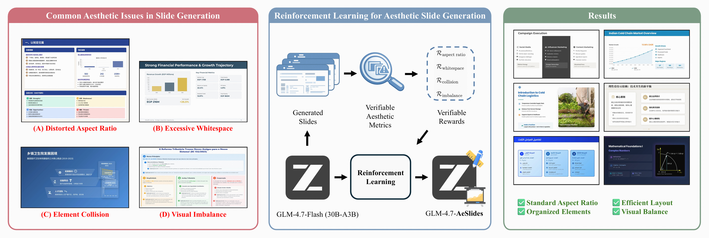

# AeSlides: A Reinforcement Learning Framework for Aesthetic Slide Generation

[](https://huggingface.co/ympan/GLM-4.7-Flash-AeSlides) [](https://huggingface.co/datasets/ympan/aeslides-reward-bench) [](https://arxiv.org/abs/2604.22840)


## Overview



AeSlides is a reinforcement learning framework designed to improve the **aesthetic layout quality** of slides generated by large language models (LLMs).

Current slide generation systems suffer from a fundamental **modality gap**: generation is text-centric, while quality is visually evaluated. This leads to common layout issues such as distorted aspect ratios, excessive whitespace, element collisions, and visual imbalance.

AeSlides addresses this by introducing **verifiable aesthetic metrics** and directly optimizing them via reinforcement learning.


## Key Ideas

### Motivation

Slide generation suffers from a fundamental **modality gap**: models generate slides in a textual/structured format (e.g., HTML), while their quality is judged in the visual domain. This mismatch directly limits the model’s ability to produce aesthetically coherent layouts.

Existing approaches attempt to mitigate this gap but remain insufficient:

- **Template-based methods** lack flexibility and fail to generalize to diverse layout requirements  
- **Agentic reflection** introduces high inference cost while providing limited gains, especially for fine-grained aesthetics  
- **Supervised fine-tuning on large-scale slide corpora** only provides indirect and weak aesthetic supervision  

A common approach is to use VLM-based scoring as a reward signal or evaluation metric. However, our analysis shows that:

- VLMs exhibit **systematic blind spots** (e.g., failing to detect aspect ratio violations)  
- VLM scores have **low discriminative power and weak correlation with human judgment**  
- They are prone to **bias and reward hacking**, making them unreliable for optimization  
- They are **computationally expensive and slow**, introducing significant latency and cost overhead in training pipelines  

These limitations suggest another paradigm that directly leverages verifiable aesthetic metrics for optimization.


### Verifiable Aesthetic Metrics

Instead of relying on VLM-based scoring or implicit supervision, AeSlides defines **programmatically verifiable metrics** for layout issue detection:

- Distorted Aspect Ratio  
- Excessive Whitespace  
- Element Collision  
- Visual Imbalance  

These metrics are:

- Accurate  
- Low-cost and low-latency  
- Well-suited for reinforcement learning optimization  


### RL with Verifiable Rewards

We optimize slide generation using **GRPO-based reinforcement learning**, with:

- Multi-objective reward shaping  
- Reward-decoupled normalization  
- KL regularization for stability  

This enables direct alignment with human aesthetic preferences.


### Lightweight but Effective

With only ~5K training samples:

- Aspect ratio compliance: **36% → 85%**  
- Whitespace: **↓ 44%**  
- Collision: **↓ 43%**  
- Visual imbalance: **↓ 28%**  
- Human score: **+7.6%**  


## Notes

Due to proprietary constraints, we do not release the full system implementation, including decoupled render infrastructure, system prompts, tool implementations, etc.

To improve reproducibility, we provide core mechanism snippets, including:

- Reward-decoupled normalization (multi-reward RL stabilization)
- Reward shaping strategies
- Local variance map based whitespace detection
- The core logic of playwright-based rendering

These are extracted from the original system and can be adapted and merged into your own training or inference pipeline. 

Besides, AeSlides is also integrated into GLM-5. To experience the full slide generation capability of GLM-5 with AeSlides, visit: 👉 https://chat.z.ai


## Citation

If you find this work useful, please cite:

```
Will be updated upon arXiv release.
```
